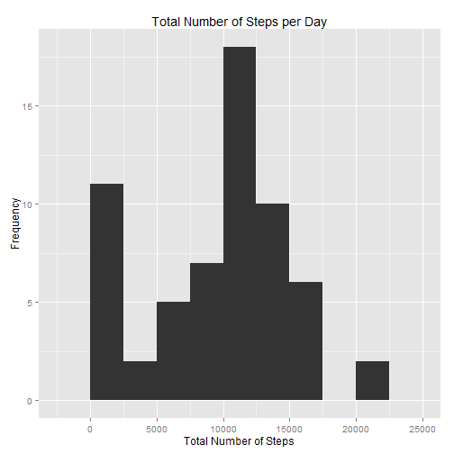
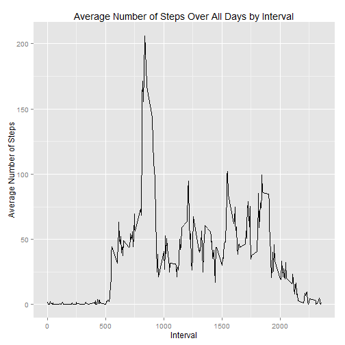
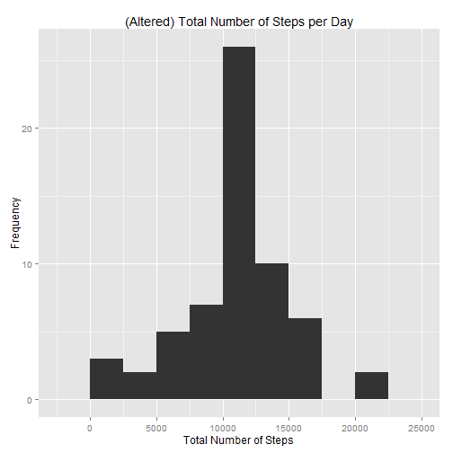
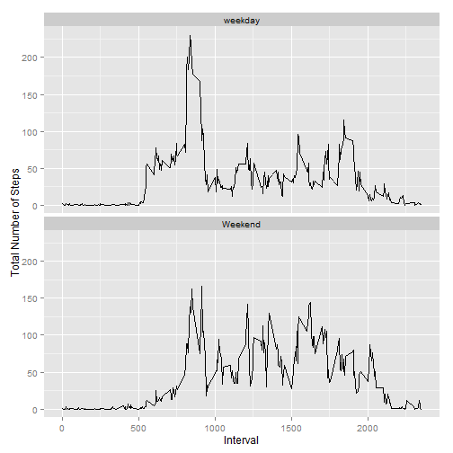

This is an R Markdown document. This file has been created for the Reproducible Research Course as part of the Data Science Specialization offered at John Hopkins University.


## Loading and preprocessing the data


Load the necessary libraries that will be used


```r
library(dplyr) #For data manipulation
library(ggplot2) #For charting
library(lubridate) #For date and time manipulation
```

Load the data


```r
step_data <- read.csv("activity.csv", header=TRUE)
```


## What is mean total number of steps taken per day?


Calculate the total number of steps taken per day


```r
step_total <- tapply(step_data$step, step_data$date, sum, na.rm = TRUE, simplify = TRUE)
```

Make a histogram of the total number of steps taken each day


```r
qplot(step_total,geom="histogram", binwidth=2500, xlab="Total Number of Steps", ylab="Frequency", main="Total Number of Steps per Day")
```

 

Calculate and report the mean and median of the total number of steps taken per day


```r
summary(step_total) #Includes both Median & Mean
```

```
##    Min. 1st Qu.  Median    Mean 3rd Qu.    Max. 
##       0    6778   10400    9354   12810   21190
```


## What is the average daily activity pattern?


Make a time series plot (i.e. type = "l") of the 5-minute interval (x-axis) and the average number of steps taken, averaged across all days (y-axis)


```r
step_avg <- step_data %>% group_by(interval) %>% summarize(average=mean(steps,na.rm=TRUE))
qplot(interval,average,data=step_avg,geom="line",xlab="Interval",ylab="Average Number of Steps",main = "Average Number of Steps Over All Days by Interval")
```

 

Which 5-minute interval, on average across all the days in the dataset, contains the maximum number of steps?


```r
# "which.max(step_avg$average)" will find the index of the max value of the step values
# the second part is subsetting the index into the interval
step_avg$interval[which.max(step_avg$average)]
```

```
## [1] 835
```


## Inputing missing values


Calculate and report the total number of missing values in the dataset


```r
sum(is.na(step_data))
```

```
## [1] 2304
```

Devise a strategy for filling in all of the missing values in the dataset. Create a new dataset that is equal to the original dataset but with the missing data filled in.


```r
# Strategy involves finding the interval for the missing value and then using the average steps averaged over all the days for the missing value
alt_step_data <- step_data
for (i in seq_along(alt_step_data$steps)){
    if (is.na(alt_step_data$steps[i])) {
        int <- alt_step_data$interval[i]
        alt_step_data$steps[i] <- step_avg$average[which(step_avg$interval == int)]
    }
}
```

Make a histogram of the total number of steps taken each day


```r
alt_step_total <- tapply(alt_step_data$step, alt_step_data$date, sum, na.rm = TRUE, simplify = TRUE)
qplot(alt_step_total,geom="histogram", binwidth=2500, xlab="Total Number of Steps", ylab="Frequency", main="(Altered) Total Number of Steps per Day")
```

 

Calculate and report the mean and median total number of steps taken per day.


```r
summary(alt_step_total)
```

```
##    Min. 1st Qu.  Median    Mean 3rd Qu.    Max. 
##      41    9819   10770   10770   12810   21190
```

These values differ from the original unaltered values. The altered values have centralized the data so that the median and mean are similar. The impact of missing data on the estimates of the total daily number of steps has increased overall.

## Are there differences in activity patterns between weekdays and weekends?

Create a new factor variable in the dataset with two levels - "weekday" and "weekend" indicating whether a given date is a weekday or weekend day.


```r
alt_step_data <- alt_step_data %>% mutate(weekday = wday(date), wday = ifelse (weekday == 1 | weekday == 7, "Weekend", "weekday"))
```

Make a panel plot containing a time series plot of the 5-minute interval (x-axis) and the average number of steps taken, averaged across all weekday days or weekend days (y-axis).


```r
alt_condensed_step_data <- aggregate(steps ~ interval+wday, alt_step_data, mean)
qplot(interval, steps, data=alt_condensed_step_data, geom=c("line"), xlab = "Interval", ylab="Total Number of Steps") + facet_wrap(~ wday, ncol=1)
```

 
